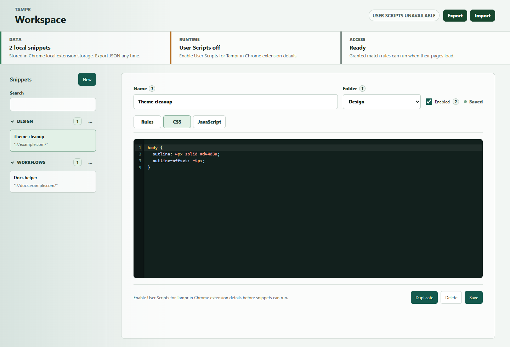
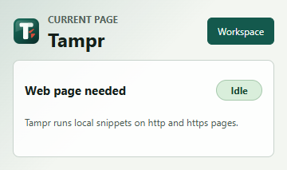

# Tampr

Tampr is the lightweight, local-first Chrome extension for writing clear,
personal CSS and JavaScript browser mods.

Status: active pre-release development.

## What It Does

- Creates and edits local CSS and JavaScript snippets.
- Groups snippets into collapsible, lightweight folders in the workspace.
- Creates starter snippets from pages with a visual Blueprint picker.
- Targets snippets with Chrome web match rules and exclude rules.
- Shows what matches the current page from the popup.
- Shows a per-tab extension badge count when snippets run on the current page.
- Guides users to enable Chrome User Scripts when the browser setting is off.
- Enables and disables matching snippets quickly.
- Registers snippets through Chrome's User Scripts runtime.
- Lets user-script world snippets save generated text or validated http/https
  URL downloads with a constrained `Tampr.download()` API.
- Exports and imports native Tampr JSON.
- Explains local data, runtime, and host-access state in the workspace.

Tampr does not use accounts, cloud sync, telemetry, hosted snippet feeds, or
remote snippet execution.

## Blueprint Creator

Open the popup on an http or https page and choose Blueprint. Tampr temporarily
highlights page elements, lets you choose a CSS-first action such as Hide,
Highlight, Remove overlay, Make sticky, Widen, or Print cleanup, saves the
result as a normal CSS snippet in the Blueprints folder, and opens it in the
workspace for review. The workspace Blueprint panel can add, remove, reorder,
relabel, switch CSS action nodes, re-pick selectors, and test selectors against
the source page while keeping generated code visible and editable. Early
automation nodes can also be added to generate readable JavaScript for waits,
clicks, form values, text extraction, and JSON downloads.

## Screenshots





## Install From Source

```sh
npm install
npm run build
```

Then in Chrome:

1. Open `chrome://extensions`.
2. Enable Developer mode.
3. Choose Load unpacked.
4. Select this repository's generated `dist` directory.

Chrome 138 or newer is required. Chrome may also require the Tampr extension
detail page's User Scripts toggle before snippets can run.

## Development

```sh
npm run dev:extension
```

Load or reload `dist` once after the first development build. Development builds
include a small reload watcher so Tampr reloads when Vite writes the next build.

Run the local quality gates:

```sh
npm run check
npm run test:e2e
```

Useful commands:

| Command                 | Purpose                                                    |
| ----------------------- | ---------------------------------------------------------- |
| `npm run build`         | Typecheck and build the extension into `dist`.             |
| `npm run check`         | Run formatting, linting, typecheck, tests, and build.      |
| `npm run dev`           | Preview popup and workspace HTML through Vite.             |
| `npm run dev:extension` | Rebuild unpacked output and trigger dev extension reloads. |
| `npm run format`        | Format tracked source and docs.                            |
| `npm run lint`          | Lint TypeScript and config files.                          |
| `npm test`              | Run unit and integration tests.                            |
| `npm run test:e2e`      | Build and run Playwright extension smoke tests.            |
| `npm run typecheck`     | Run strict TypeScript checking.                            |

See [Development](./docs/development.md) for the full local workflow.

## Pre-Releases

Tampr publishes GitHub pre-releases from version tags. Pushing a tag like
`v0.1.0-alpha.1` runs the release workflow, builds the extension, packages
`dist`, and attaches `tampr-v0.1.0-alpha.1.zip` to the GitHub release.

## Architecture

```text
src/
  background/  service-worker message orchestration
  blueprint/   temporary page picker behavior for Blueprint creation
  chrome/      thin typed adapters around Chrome APIs
  domain/      snippet models, match rules, import/export, pure logic
  popup/       current-page control surface
  runtime/     Chrome User Scripts registration behavior
  shared/      contracts shared across extension surfaces
  storage/     versioned local persistence
  workspace/   full snippet editor UI
tests/
  e2e/
  integration/
  unit/
docs/
```

The service worker stays direct and framework-light. React belongs to the popup
and workspace UI. Runtime, storage, import/export, and match-rule behavior stay
typed and testable outside the browser where possible.

## Data And Trust

Tampr stores snippets in Chrome local extension storage. The workspace exports
native Tampr version 1 JSON:

```json
{
  "format": "tampr",
  "version": 1,
  "exportedAt": 1748000000000,
  "data": {
    "snippets": []
  }
}
```

Imports are runtime-validated before storage changes and merge by stable snippet
ID. Exports include local snippet records and optional Blueprint recipe metadata
only. Manual export is the V1 backup path. Tampr uses Chrome downloads access
for workspace exports and for the user-script world `Tampr.download()` API,
which accepts generated text payloads or validated http/https URLs together with
a relative downloads-folder filename. Automatic backups are deferred to avoid
scheduled background writes.

Read more:

- [Privacy And Security](./docs/privacy-security.md)
- [Trust Checks](./docs/trust-checks.md)

## Contributing

Start with [Contributing](./CONTRIBUTING.md). Pull requests should keep Tampr
local-first, permission-conscious, and lightweight. Commit messages follow
Conventional Commits and are linted locally.

## License

Tampr is released under the [MIT License](./LICENSE).
